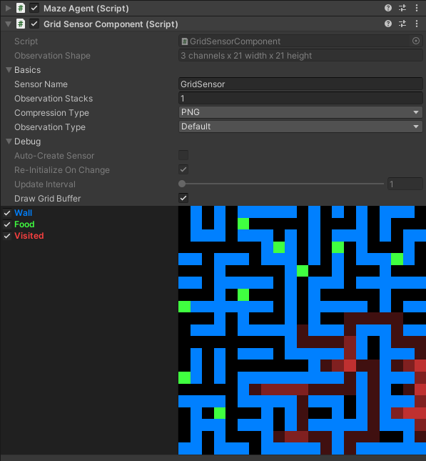
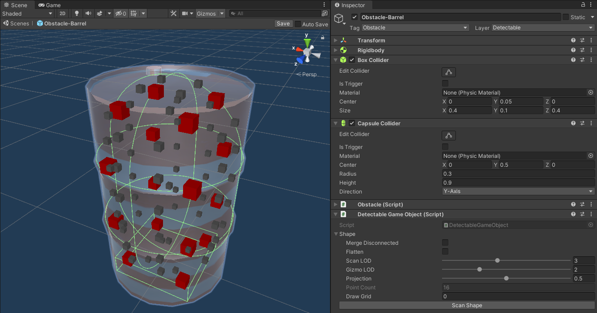
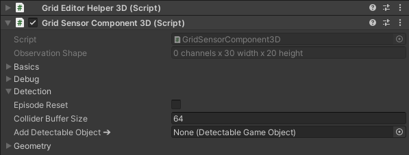
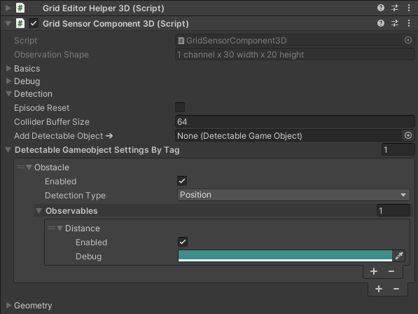
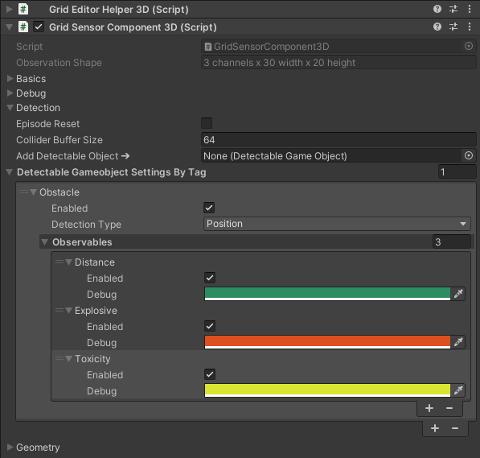
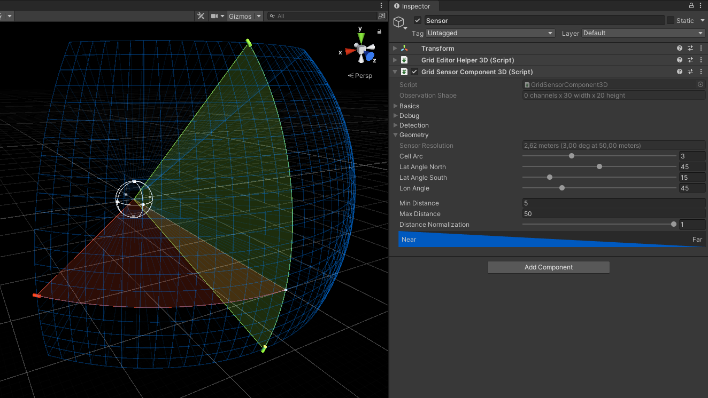
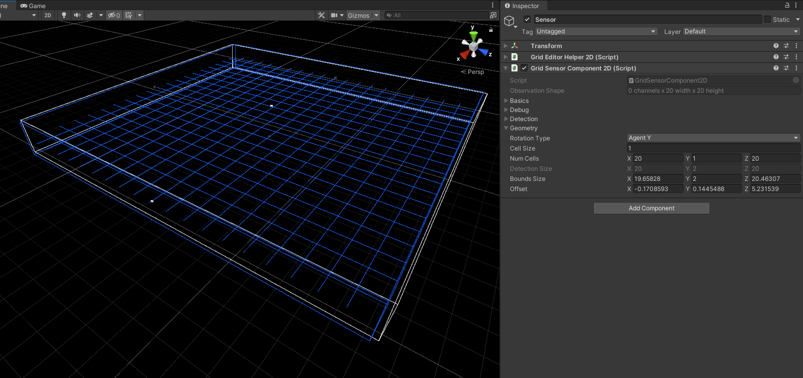

# Grid Sensors for Unity ML-Agents - Version 2.0
This is a collection of Grid Sensor Components for the [Unity Machine Learning Agents Toolkit](https://github.com/Unity-Technologies/ml-agents).  
It is compatible with [v2.1.0 / release 18](https://github.com/Unity-Technologies/ml-agents/releases/tag/release_18). You can find the previous version for v1.9.0 / release 15 [here](https://github.com/mbaske/grid-sensor/tree/version1).

* [What's new in Version 2.0](#What's-new-in-Version-2.0)  
* [Grid Sensor Component](#Grid-Sensor-Component)  
    - [General Sensor Settings](#General-Sensor-Settings)
    - [How to implement your own grid observations](#How-to-implement-your-own-grid-observations)
* [Detecting Game Objects](#Detecting-Game-Objects)  
    - [Preparing Detectable Game Objects](#Preparing-Detectable-Game-Objects) 
        - [Shape Settings](#Shape-Settings)
    - [Detection Settings](#Detection-Settings)
        - [Observables](#Observables)
    - [Sensor Geometry](#Sensor-Geometry)
        - [Grid Sensor Component 3D](#Grid-Sensor-Component-3D)  
        - [Grid Sensor Component 2D](#Grid-Sensor-Component-2D)  
* [Examples](#Examples)  
    - [Maze Explorer](#Maze-Explorer)
    - [Dogfight](#Dogfight)
    - [Driver](#Driver)
    - [Food Collector](#Food-Collector)
* [Dependencies](#Dependencies)
* [Demo Video](https://youtu.be/F4qTP_wA40s)
<br/><br/>

# What's new in Version 2.0

* New minimalistic [GridSensorComponent](https://github.com/mbaske/grid-sensor/blob/master/Assets/Scripts/Sensors/Grid/Basic/Sensor/GridSensorComponent.cs) and accompanying [Maze Explorer](#Maze-Explorer) example.
* Component inspector settings are grouped into foldouts.
* Integrated visualization and debugging options.
* There are no longer separate 2D and 3D variants of the [DetectableGameObject](https://github.com/mbaske/grid-sensor/blob/master/Assets/Scripts/Sensors/Grid/GameObject/Detection/DetectableGameObject.cs) component.
* Easier handling of observables, `Distance` and `One-Hot` are set depending on detection type.
* Improved shape scanning algorithm and interface. Now supports concave colliders and context sensitive levels of detail. 
* The `Scan-At-Runtime` option has been removed in favour of explicit method calls.
* Frustum culling for [GridSensorComponent3D](https://github.com/mbaske/grid-sensor/blob/master/Assets/Scripts/Sensors/Grid/GameObject/Sensor/GridSensorComponent3D.cs) with convex FOVs increases detection speed.
* For stacked observations, the grid sensor is now being wrapped in ML-Agent's [StackingSensor](https://docs.unity3d.com/Packages/com.unity.ml-agents@2.1/api/Unity.MLAgents.Sensors.StackingSensor.html).
* Optional detectors and encoders implement the [IDetector](https://github.com/mbaske/grid-sensor/blob/master/Assets/Scripts/Sensors/Grid/Basic/Detection/IDetector.cs) and [IEncoder](https://github.com/mbaske/grid-sensor/blob/master/Assets/Scripts/Sensors/Grid/Basic/Encoding/IEncoder.cs) interfaces, rather than extending abstract classes.
* Various classes have been renamed, e.g. the former ChannelGrid and PixelGrid are now called [GridBuffer](https://github.com/mbaske/grid-sensor/blob/master/Assets/Scripts/Sensors/Grid/Basic/Sensor/GridBuffer.cs) and [ColorGridBuffer](https://github.com/mbaske/grid-sensor/blob/master/Assets/Scripts/Sensors/Grid/Basic/Sensor/ColorGridBuffer.cs).
* Code refactoring and comments.

I debated with myself if I should add support for 2D physics, but decided against it in the end. The reason being that the typical use case for 2D physics is platformer games. Those tend to require pretty high resolution observations though. Using camera sensors should generally be the better option for platformers.
<br/><br/>

# Grid Sensor Component

  

The [GridSensorComponent](https://github.com/mbaske/grid-sensor/blob/master/Assets/Scripts/Sensors/Grid/Basic/Sensor/GridSensorComponent.cs) provides the basic functionality required for visual grid observations. It wraps a [GridSensor](https://github.com/mbaske/grid-sensor/blob/master/Assets/Scripts/Sensors/Grid/Basic/Sensor/GridSensor.cs) and exposes a [GridBuffer](https://github.com/mbaske/grid-sensor/blob/master/Assets/Scripts/Sensors/Grid/Basic/Sensor/GridBuffer.cs), to which you can write normalized float values. You can instantiate and [assign the buffer](https://github.com/mbaske/grid-sensor/blob/master/Assets/Scripts/Sensors/Grid/Basic/Sensor/GridSensorComponentBase.cs#L171) yourself, or let the component generate one matching the [GridBuffer.Shape](https://github.com/mbaske/grid-sensor/blob/master/Assets/Scripts/Sensors/Grid/Basic/Sensor/GridBuffer.cs#L13) settings [you specify](https://github.com/mbaske/grid-sensor/blob/master/Assets/Scripts/Sensors/Grid/Basic/Sensor/GridSensorComponentBase.cs#L182). Note that you need to create a [ColorGridBuffer](https://github.com/mbaske/grid-sensor/blob/master/Assets/Scripts/Sensors/Grid/Basic/Sensor/ColorGridBuffer.cs) (which extends GridBuffer and stores color values), if you're applying PNG compression to the observation. All my grid sensor components generate ColorGridBuffers as their default.

A word of caution regarding initialization order: sensors are created by the ML-Agents framework when the associated agent is enabled. The GridSensorComponent must have a GridBuffer, or at least a GridBuffer.Shape assigned to it when this happens. You can always disable the agent gameobject in the editor and enable it at runtime, in case you need to run initialization logic elsewhere before making the necessary data available to the GridSensorComponent.

The [Maze Explorer](#Maze-Explorer) example demonstrates how to integrate the basic GridSensorComponent with an agent.
<br/><br/>

## General Sensor Settings  

The following inspector settings apply to the basic [GridSensorComponent](https://github.com/mbaske/grid-sensor/blob/master/Assets/Scripts/Sensors/Grid/Basic/Sensor/GridSensorComponent.cs), as well as to the gameobject detecting [GridSensorComponent2D](https://github.com/mbaske/grid-sensor/blob/master/Assets/Scripts/Sensors/Grid/GameObject/Sensor/GridSensorComponent2D.cs) and [GridSensorComponent3D](https://github.com/mbaske/grid-sensor/blob/master/Assets/Scripts/Sensors/Grid/GameObject/Sensor/GridSensorComponent3D.cs), since all of them extend [GridSensorComponentBase](https://github.com/mbaske/grid-sensor/blob/master/Assets/Scripts/Sensors/Grid/Basic/Sensor/GridSensorComponentBase.cs).

* `Observation Shape` (read only) - Shape of the sensor's visual observation. Unlike in the previous version, its channel count *does not* include stacked observations.
* _**Basics**_
    - `Sensor Name` - Name of the generated grid sensor.
    - `Observation Stacks` - The number of stacked observations.
    - `Compression Type` - The sensor compression type used by the sensor, `PNG` (default) or `None`.
    - `Observation Type` - The observation type for the sensor, `Default` or `Goal Signal`.
* _**Debug**_
    - `Auto-Create Sensor` - Whether the component should create its sensor on Awake. Select this option to test a stand-alone sensor component not attached to an agent.
    - `Re-Initialize On Change` - Whether to recreate the sensor everytime inspector settings change. Select this option to immediately see the effects of settings updates that would otherwise not be changeable at runtime. Only available for auto-created sensor.
    - `Update Interval` - FixedUpdate interval for auto-created sensor.
    - `Draw Grid Buffer` - Whether to draw the grid buffer contents to the inspector (runtime only). Requires constant repaint and is somewhat expensive - expect your framerates to drop with this option enabled. In rare cases, the visualization might freeze and you'll need to unselect and reselect the checkbox. The channel filter names and colors below are defined in a list of [ChannelLabel](https://github.com/mbaske/grid-sensor/blob/master/Assets/Scripts/Sensors/Grid/Basic/Debug/ChannelLabel.cs)s, that you can [assign to the sensor component](https://github.com/mbaske/grid-sensor/blob/master/Assets/Scripts/Sensors/Grid/Basic/Sensor/GridSensorComponentBase.cs#L99) (fallback values are provided if you don't). Note that there is a [bug in ML-Agents' behavior parameters editor](https://github.com/Unity-Technologies/ml-agents/issues/5443) which can break grid drawing (and possibly a couple of other things). To work around it, the grid sensor component hides the behavior parameters inspector at runtime. 
<br/><br/>

## How to implement your own grid observations

There are three ways you can feed your observation to the grid sensor:

* Use the [GridSensorComponent](https://github.com/mbaske/grid-sensor/blob/master/Assets/Scripts/Sensors/Grid/Basic/Sensor/GridSensorComponent.cs) as is and write grid values directly to its [GridBuffer](https://github.com/mbaske/grid-sensor/blob/master/Assets/Scripts/Sensors/Grid/Basic/Sensor/GridBuffer.cs). The [MazeAgent](https://github.com/mbaske/grid-sensor/blob/master/Assets/Examples/MazeExplorer/Scripts/MazeAgent.cs) utilizes this approach.
* Extend [GridSensorComponent](https://github.com/mbaske/grid-sensor/blob/master/Assets/Scripts/Sensors/Grid/Basic/Sensor/GridSensorComponent.cs) and implement your code for mapping observations to grid values in a custom sensor component.
* In addition to the second option, you can create *detectors* and *encoders*, encapsulating the logic for arbitrary detection types, and for encoding the results to the [GridBuffer](https://github.com/mbaske/grid-sensor/blob/master/Assets/Scripts/Sensors/Grid/Basic/Sensor/GridBuffer.cs). This is how the gameobject detecting [GridSensorComponent2D](https://github.com/mbaske/grid-sensor/blob/master/Assets/Scripts/Sensors/Grid/GameObject/Sensor/GridSensorComponent2D.cs) and [GridSensorComponent3D](https://github.com/mbaske/grid-sensor/blob/master/Assets/Scripts/Sensors/Grid/GameObject/Sensor/GridSensorComponent3D.cs) work. The [GridSensor](https://github.com/mbaske/grid-sensor/blob/master/Assets/Scripts/Sensors/Grid/Basic/Sensor/GridSensor.cs#L24) has optional [IDetector](https://github.com/mbaske/grid-sensor/blob/master/Assets/Scripts/Sensors/Grid/Basic/Detection/IDetector.cs) and [IEncoder](https://github.com/mbaske/grid-sensor/blob/master/Assets/Scripts/Sensors/Grid/Basic/Encoding/IEncoder.cs) properties. A detector generates a [DetectionResult](https://github.com/mbaske/grid-sensor/blob/master/Assets/Scripts/Sensors/Grid/Basic/Detection/DetectionResult.cs), which contains a collection of [DetectionResult.Item](https://github.com/mbaske/grid-sensor/blob/master/Assets/Scripts/Sensors/Grid/Basic/Detection/DetectionResult.cs#L12)s. Each item in turn stores an [IDetectable](https://github.com/mbaske/grid-sensor/blob/master/Assets/Scripts/Sensors/Grid/Basic/Detection/IDetectable.cs) instance and its associated grid points. An encoder processes the detection result and generates the corresponding grid channel values. The grid sensor [automatically invokes](https://github.com/mbaske/grid-sensor/blob/master/Assets/Scripts/Sensors/Grid/Basic/Sensor/GridSensor.cs#L165) the necessary methods on update, if its detector and encoder properties are set.
<br/><br/>

# Detecting Game Objects

Add a [GridSensorComponent2D](https://github.com/mbaske/grid-sensor/blob/master/Assets/Scripts/Sensors/Grid/GameObject/Sensor/GridSensorComponent2D.cs) or [GridSensorComponent3D](https://github.com/mbaske/grid-sensor/blob/master/Assets/Scripts/Sensors/Grid/GameObject/Sensor/GridSensorComponent3D.cs) to your agents for gameobject detection. The 2D variant is comparable to [Unity's GridSensorComponent](https://docs.unity3d.com/Packages/com.unity.ml-agents@2.1/api/Unity.MLAgents.Sensors.GridSensorComponent.html). It finds objects sitting on a plane, whereas the 3D sensor performs spatial detection within a given field of view.

Although their results are similar, my sensor uses a different detection approach than Unity's sensor. Rather than checking collider overlaps for every grid position, my sensor is point based. This means that an object's shape is represented as a set of cached local points, which are then transformed into the sensor's frame of reference. The benefit of my method is that it [scales better for multiple sensor instances](https://youtu.be/F4qTP_wA40s?t=210), because it requires far less overlap checks. On the downside however, using my sensor involves a bit more preparatory work.

There are three options as to what can be detected about a gameobject: 
* Its transform's position.
* The closest point on its colliders.
* A set of points roughly matching the object's shape.
<br/><br/>

## Preparing Detectable Game Objects

A detectable gameobject must have a [DetectableGameObject](https://github.com/mbaske/grid-sensor/blob/master/Assets/Scripts/Sensors/Grid/GameObject/Detection/DetectableGameObject.cs) component attached to it. Detectable gameobject types are distinguished by their tags. You can later apply different detection settings for each specific object type/tag. Simply adding the component is sufficient, as long as your sensor only detects the object's position or closest collider point. 

For shape detection on the other hand, it is necessary to generate a set of points, using the `Shape` inspector settings. I'm referring to creating these points as *scanning* an object. For best runtime performance, you would typically do this upfront. Ideally in edit mode, so that points can be serialized and stored with the detectable object's prefab. Sometimes though, object shapes are dynamic and points can't be generated ahead of time. In that case, you can invoke DetectableGameObject's [ScanShapeRuntime](https://github.com/mbaske/grid-sensor/blob/master/Assets/Scripts/Sensors/Grid/GameObject/Detection/DetectableGameObject.cs#L67) method. Scanning objects can be costly - if you call this method on multiple objects at once, the scans will be queued and 5 of them are executed per frame. The [Dogfight example](#Dogfight) runs batched scanning at initialization for all the randomized asteroid shapes. When entering play mode, it'll take a moment for all scans to complete.

### Shape Settings

  

Open your detectable gameobject prefab and enable Gizmos to see how different settings produce various sets of points. The 3D sensor variant uses levels of detail for reducing the amount of points it needs to process, depending on the distance between sensor and object. For 2D, the specified LOD is fixed because detectable points don't change with distance. 

The shape scanning algorithm splits gameobjects into separate *volumes*, if they contain multiple disconnected colliders. It then tries to find matching LODs, which works best for similar sized colliders. You don't need to worry about this if your object only has a single or compound collider.

* `Merge Disconnected` - Whether to merge disconnected colliders into a single volume. Can affect LOD points.
* `Flatten` - Whether to place all points on the gameobject's XZ-plane. This option is typically enabled for 2D detection.
* `Scan LOD` - The level of detail applied to scanning. Note that this is a relative value and results depend on the object's size. There is a hard limit beyond which the resolution can't be increased. Therefore small objects support less LODs than large ones.
* `Gizmo LOD` - Highlights points for the selected LOD. Change this value to see what points the detector will register depending on the object's distance.
* `Projection` - Shape points are located *inside* of colliders. Increasing this value will project them outward onto the collider bounds. Single convex colliders normally produce the best results.
* `Point Count` (read only) - The number of points for the current LOD.
* `Draw Grid` - Set a value to draw grid cells of matching size around the detectable points. This is meant for testing purposes and is independent of sensor component settings. You can use this option for visualizing how different grid sizes and Scan LODs work together, in order to adjust your settings.
* `Scan Shape` - Press this button to force a new scan after you've updated the object's colliders. Changing the settings above will automatically trigger scanning if required.

`Gizmo LOD` and `Projection` settings are disabled for flattened points. Don't forget to save your prefab after you're done scanning the gameobject shape.
<br/><br/>

## Detection Settings

A newly added GridSensorComponent2D or GridSensorComponent3D can't detect anything, because it is unaware of any detectable gameobject types.

  

Drag detectable gameobject prefabs you have prepared onto the `Add Detectable Object` field.

  

Here, the barrel prefab from above was added this way. Now the `Detectable Gameobject Settings By Tag` list appears. It contains the detection settings for each detectable gameobject tag. The barrel has the tag "Obstacle", hence that's the name of the first list item.

Importantly, its settings will later apply to *all* detectable gameobjects sharing the "Obstacle" tag. The [Driver](#Driver) example shows how different gameobjects - barrel, cone and roadblock - are all treated equally by the sensor, because they are all tagged "Obstacle". Technically, the sensor could have just used a tag list to accomplish this, like Unity's grid sensor does. The reason for this particular workflow is that it enables the sensor component to read custom observable definitions from DetectableGameobject. Which makes implementing your own observables super easy, see below. 

Every type of detectable object has an `Enabled` option, determining whether it is included in the sensor observations.  

Below that, you set the object's `Detection Type` to `Position`, `Closest Point` or `Shape`. If you select the `Shape` option, another dropdown called `Modifier` appears. Modifiers change the appearance of shape points in the observed grid. By default, points are rendered as is, the corresponding option is `None`. The other options represent various fill algorithms, attempting to make a set of scatterd points appear like a solid object. `Orthogonal Fill` usually works best for roughly rectangular objects. `Dilation` is a good option for irregular shapes.

### Observables

The nested `Observables` list contains the observables associated with the specified tag. Every detectable object type must have at least one enabled observable. There are two default observables, `Distance` and `One-Hot`, which are being added for the 3D and 2D sensor variants respectively, if no custom observables are defined.

Again, use the `Enabled` option to include or exclude individual observables from detection. The `Debug` color field determines how the associated grid channel is visualized in the inspector, [see above](#Inspector-Settings). Its initial value is picked randomly.

You can add your own observables by extending [DetectableGameObject](https://github.com/mbaske/grid-sensor/blob/master/Assets/Scripts/Sensors/Grid/GameObject/Detection/DetectableGameObject.cs) and attaching your derived component to the gameobject prefab instead. For each observable, you need to add its name and getter method to the `Observables` property. Getters are expected to return float values between 0 and +1. Override the `AddObservables` method like in this example:

```
public class DangerousBarrel : MBaske.Sensors.Grid.DetectableGameObject
{
    public bool IsEplosive;
    float IsEplosiveObservable() => IsEplosive ? 1 : 0;

    public float Toxicity; // Set normalized value.
    float ToxicityObservable() => Toxicity;

    public override void AddObservables()
    {
        Observables.Add("Explosive", IsEplosiveObservable);
        Observables.Add("Toxicity", ToxicityObservable);
    }
}
```

For the dangerous barrel, the component inspector looks like this:

  

Unless our cones and roadblocks are toxic and explosive as well, we now have a problem, because those objects have the same tag "Obstacle" as the barrel. The best way of dealing with this is to assign distinct tags for every subclass of DetectableGameObject. In this case, the barrel would get its own "Barrel" tag.

It's possible to delete all but one observable from the list by pressing its `-` button. Pressing `+` will re-add any previously removed observables. Although I'd recommend to just disable them instead. For a derived component containing custom observables, `+` will add `Distance` or `One-Hot` to the list. In the above screenshot, `Distance` was added via the `+` button after dragging the "DangerousBarrel" prefab onto the `Add Detectable Object` field.

Note that all detection settings so far apply to a sensor component instance. Different agents can therefore detect different aspects of the same gameobject type. A careless agent for instance would not be able to detect exactly how dangerous a dangerous barrel really is, if you were to exclude the crucial observables from its particular grid sensor.
<br/><br/>

There are two more general detection settings:
* `Episode Reset` - Whether to clear the DetectableGameObject cache on sensor reset at the end of each episode. The cache maps detected colliders to their DetectableGameObject instances, so that repeated GetComponent calls can be avoided. This option should be disabled if DetectableGameObject instances don't change from one episode to the next. Keep in mind that all sensor instances utilize a single cache: if one sensor clears it, it will be empty for the others as well. Invoking multiple clear calls at once won't cause any issues or overhead though. 
* `Collider Buffer Size` - The maximum number of colliders the sensor can detect at once. The buffer size will double automatically if the buffer is maxed out.
<br/><br/>

## Sensor Geometry

The last inspector foldout `Geometry` contains specific settings for 3D and 2D detection types.

### Grid Sensor Component 3D

  

* `Sensor Resolution` (read only) - The size of individual grid cells at the maximum specified distance.  
Visualized by the scene GUI wireframe.
* `Cell Arc` - The arc angle of a single FOV grid cell in degrees. Determines the sensor resolution:  
`cell size at distance = PI * 2 * distance / (360 / cell arc)` 

Use GUI handles or the settings below for constraining the sensor's field of view. Effective angles are rounded up depending on the `Cell Arc` value. Note that because of the projection of polar coordinates to grid pixels, positions near the poles appear increasingly distorted. If that becomes an issue, you can try adding multiple sensors with smaller FOVs and point them in different directions.

* `Lat Angle North` - The FOV's northern latitude (up) angle in degrees.
* `Lat Angle South` - The FOV's southern latitude (down) angle in degrees.
* `Lon Angle` - The FOV's longitude (left & right) angle in degrees.
* `Min Distance` - The minimum detection distance (near clipping).
* `Max Distance` - The maximum detection distance (far clipping).
* `Normalization` - How to normalize object distances. 1 for linear normalization. Set value to < 1 if observing distance changes at close range is more critical to agents than what happens farther away.
<br/><br/>

### Grid Sensor Component 2D



* `Rotation Type` - Whether and how to rotate the sensor with the agent's transform.
    - `Agent Y` - Rotate around Y-axis only, sensor is aligned with agent forward.
    - `Agent XYZ` - Rotate around all axes, sensor is aligned with agent rotation.
    - `None` - Ignore agent rotation, sensor is aligned with world forward axis.
* `Cell Size` - X/Z size of individual grid cells.
* `Num Cells` - The number of grid cells per axis.
* `Detection Size` (read only) - Actual detection bounds size of the grid sensor.  
Values are rounded to match `Cell Size`.  
Visualized by the blue box in scene view.
* `Bounds Size` - Unrounded detection bounds used for editing.  
Visualized by the white box in scene view.  
Use gizmo handles to move and change size. Available key commands in scene GUI:  
    - `S` - Snap to cell size.
    - `C` - Center on X-axis.
    - `Shift+C` - Center on all axes.
* `Offset` - Detection offset from sensor transform position.
<br/><br/>

# Examples

**For some reason, the serialized sensor settings might not get imported correctly with the prefabs when opening the project, causing some detectable tags to be missing. Open the [Assets/Examples/!Reimport/](https://github.com/mbaske/grid-sensor/tree/dev/Assets/Examples/!Reimport) folder and reimport "CarWithSensors", "SpaceshipWithSensors" and "FoodCollectorAgent". This should ensure that all settings will be restored the way I saved them.** ([Possibly related issue](https://forum.unity.com/threads/data-corruption-with-prefab-import-with-new-prefab-workflow-still.660037/))

## Maze Explorer
An agent moves stepwise through a random maze. Its grid sensor observes 3 channels: walls, food and visit values. Walls and food are one-hot observables. The visit value for each maze cell increases everytime the agent moves onto, or stays on it (enable `Debug > Draw Grid Buffer`). An episode ends when any of the cells' visit value reaches 1. Rewards are inversely proportional to this value: +0.5 for every new cell the agent discovers, and incrementally less if it stays or returns to it. The reward for finding food is +1. I didn't enable action masking when training the policy, the agent was instead penalized with a value of -1 when it wanted to move onto an occupied cell. The full maze state is stored in a [GridBuffer](https://github.com/mbaske/grid-sensor/blob/master/Assets/Scripts/Sensors/Grid/Basic/Sensor/GridBuffer.cs). In the [MazeAgent](https://github.com/mbaske/grid-sensor/blob/master/Assets/Examples/MazeExplorer/Scripts/MazeAgent.cs#L261) code, a small section of it (agent's vicinity) is repeatedly being copied to the [GridSensorComponent](https://github.com/mbaske/grid-sensor/blob/master/Assets/Scripts/Sensors/Grid/Basic/Sensor/GridSensorComponent.cs)'s [ColorGridBuffer](https://github.com/mbaske/grid-sensor/blob/master/Assets/Scripts/Sensors/Grid/Basic/Sensor/ColorGridBuffer.cs).

## Dogfight

Agents control spaceships flying through an asteroid field, using discrete actions for throttle, pitch and roll. Each agent observes its surroundings with two [GridSensorComponent3D](https://github.com/mbaske/grid-sensor/blob/master/Assets/Scripts/Sensors/Grid/GameObject/Sensor/GridSensorComponent3D.cs)s. A front-facing sensor detects the distances and shapes of asteroids. An omnidirectional long-range sensor detects other ships' positions, adding a stacked observation to indicate movement. Agents are rewarded for speed while following opponents, and penalized for being followed as well as for collisions. As stated above, the asteroids' shapes are being randomized and scanned at initialization, which can take a few seconds.

## Driver

Combines [GridSensorComponent3D](https://github.com/mbaske/grid-sensor/blob/master/Assets/Scripts/Sensors/Grid/GameObject/Sensor/GridSensorComponent3D.cs) and [GridSensorComponent2D](https://github.com/mbaske/grid-sensor/blob/master/Assets/Scripts/Sensors/Grid/GameObject/Sensor/GridSensorComponent2D.cs). The agent uses continuous actions for driving a car down a procedurally generated road. It detects roadside poles and various obstacles with its two sensors. A long-range 3D sensor enables the agent to look ahead, while a short-range 2D sensor helps with evading obstacles. Again, the agent is rewarded for speed and penalized for collisions.

## Food Collector

This is the Food Collector scene from the ML-Agents examples. I modified it slightly for my [GridSensorComponent2D](https://github.com/mbaske/grid-sensor/blob/master/Assets/Scripts/Sensors/Grid/GameObject/Sensor/GridSensorComponent2D.cs): an agent's frozen state isn't indicated by switching tags any longer. Instead, the [DetectableAgent](https://github.com/mbaske/grid-sensor/blob/master/Assets/Examples/FoodCollector/Scripts/DetectableAgent.cs) component was attached to agents, adding a custom one-hot observation for their state. I also attached plain DetectableGameObject components to food, bad food and wall prefabs. The original walls were a single mesh, I split it up into four segments.
<br/><br/>

# Dependencies

* [ML-Agents 2.1](https://docs.unity3d.com/Packages/com.unity.ml-agents@2.1/manual/index.html)
* [NaughtyAttributes](https://github.com/dbrizov/NaughtyAttributes)