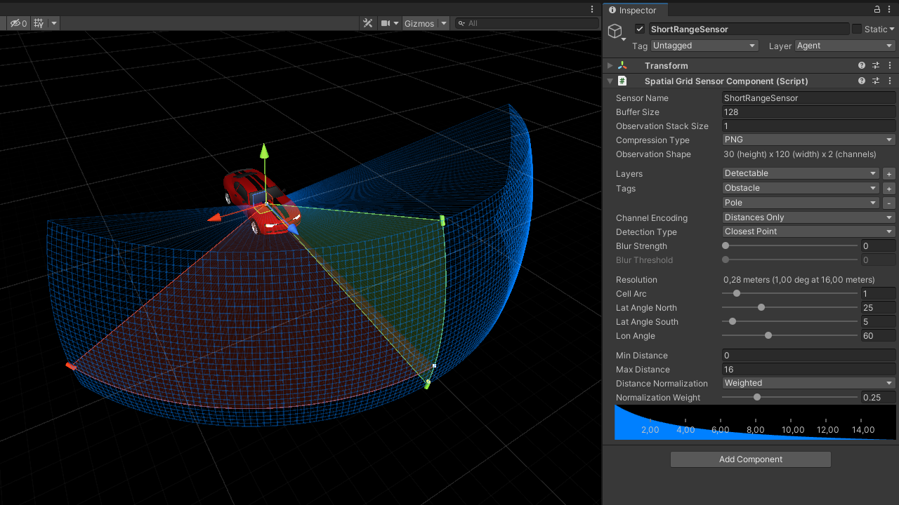
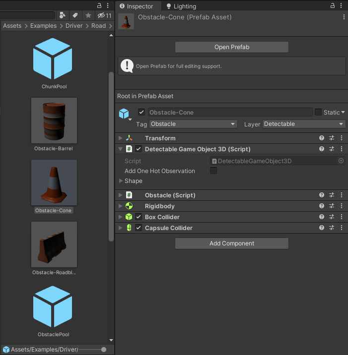
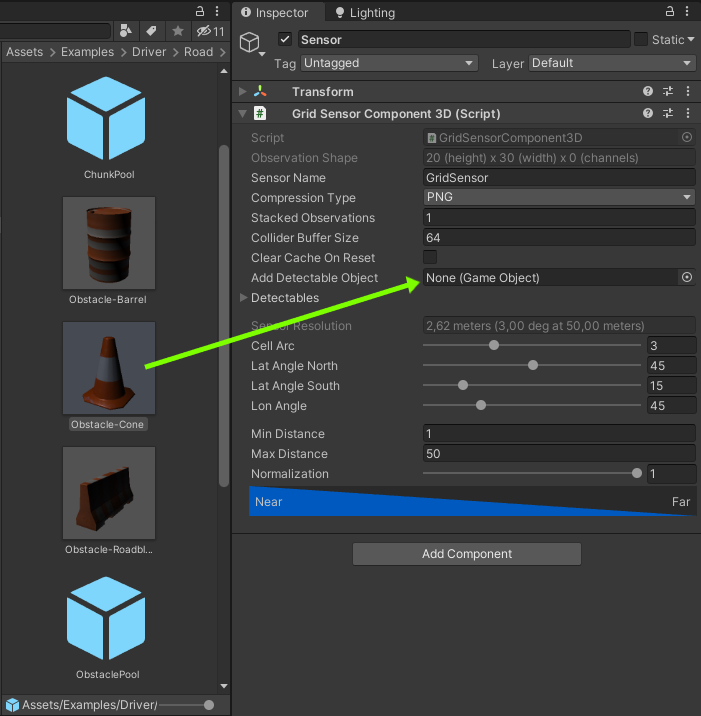
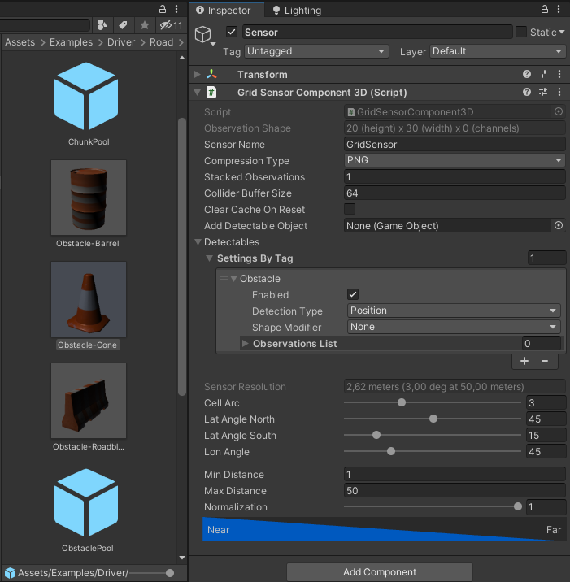
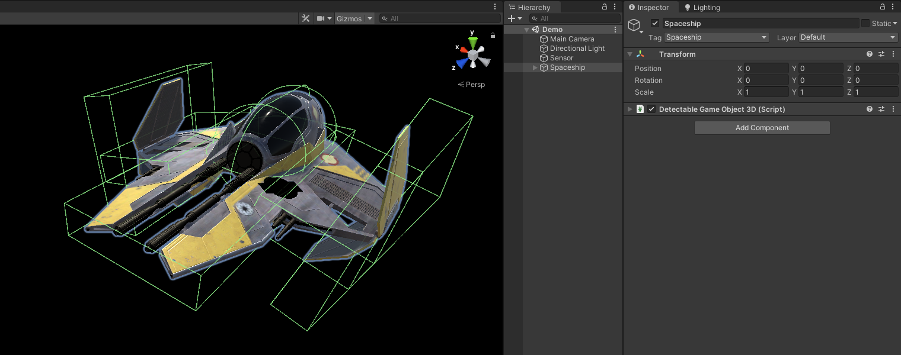
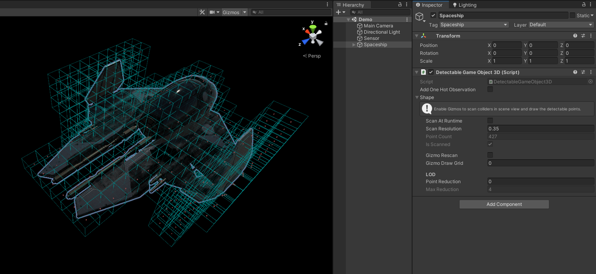
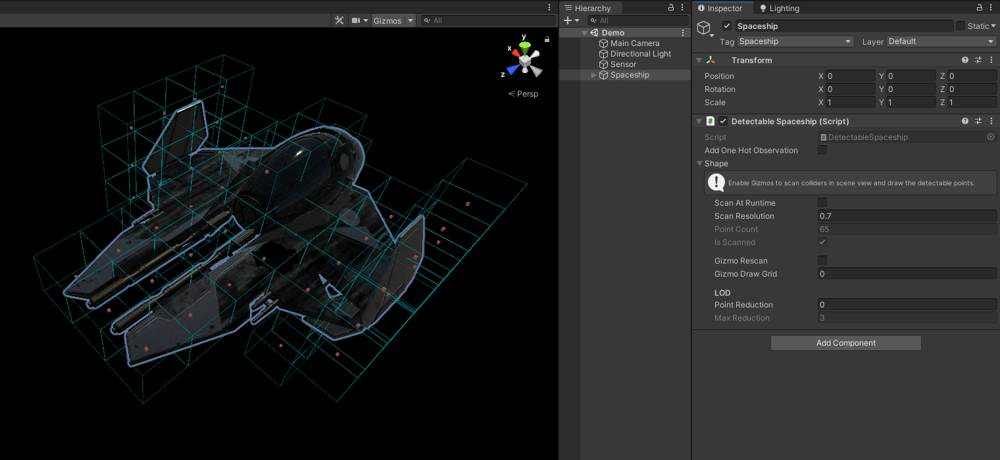
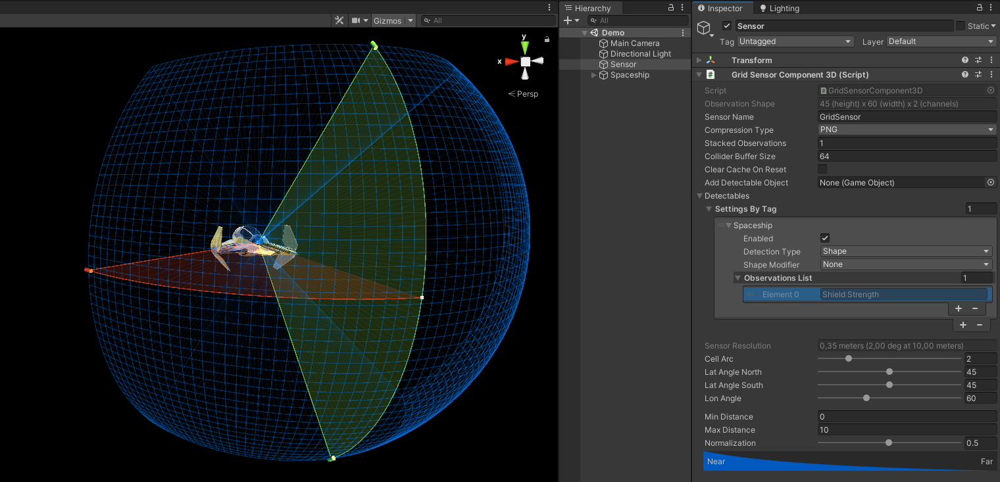
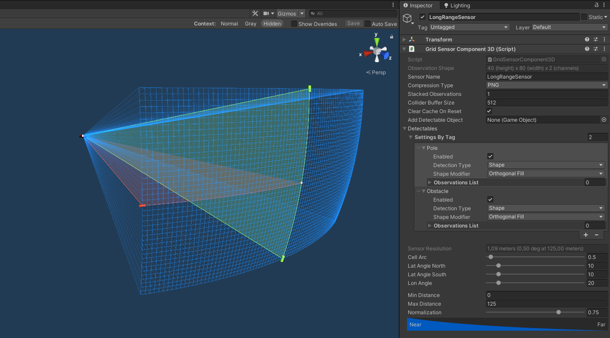
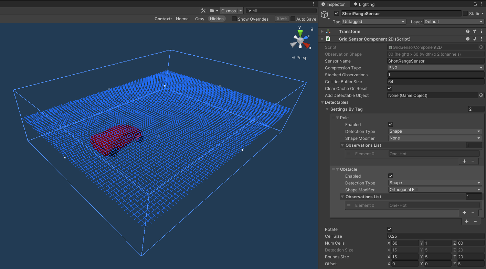

# Grid Sensor for Unity ML-Agents
This is an experimental Grid Sensor for the [Unity Machine Learning Agents Toolkit](https://github.com/Unity-Technologies/ml-agents). 

* [Concept](#Concept)  
* [Game Object Detection](#Game-Object-Detection)  
* [Workflow](#Workflow)
    - [Object Shapes](#Object-Shapes) 
    - [Custom Observations](#Custom-Observations) 
* [Sensor Settings](#Sensor-Settings)
    - [3D Specific](#3D-Specific-Settings)
    - [2D Specific](#2D-Specific-Settings)
* [Differences from Eidos Grid Sensor](#Differences-from-Eidos-Grid-Sensor)
* [Example Scenes](#Example-Scenes)  
<br/><br/>

<!--  -->

# Concept

The [GridSensor](https://github.com/mbaske/grid-sensor/tree/master/Assets/Scripts/Sensors/Grid/Shared/Sensor/GridSensor.cs) was originally developed as a simple means to encode float values as visual observations. It doesn't make any assumptions about the type of data being observed. You would typically use it together with [GridSensorComponentBase](https://github.com/mbaske/grid-sensor/tree/master/Assets/Scripts/Sensors/Grid/Shared/Sensor/GridSensorComponentBase.cs), a component that wraps the sensor class and can be attached to an agent. The sensor expects a [PixelGrid](https://github.com/mbaske/grid-sensor/tree/master/Assets/Scripts/Sensors/Grid/Shared/Data/PixelGrid.cs) data structure to read from. Implement your custom logic for mapping observations to pixels in a class which implements [IPixelGridProvider](https://github.com/mbaske/grid-sensor/tree/master/Assets/Scripts/Sensors/Grid/Shared/Data/IPixelGridProvider.cs) and make that available to the sensor component.

`Sensor Name` and `Compression Type` are the only inspector settings for GridSensorComponentBase. 

Besides this bare-bones approach, you can extend GridSensorComponentBase and build your own grid based sensor components on top of the existing structure. The GridSensor class has optional *Detector* and *Encoder* properties. A Detector provides a DetectionResult - a tag based collection of detectable objects implementing IDetectable. An Encoder parses the DetectionResult in order to populate the sensor's PixelGrid. Extending the abstract Detector and Encoder classes is one possible way of implementing custom detection/encoding logic.
<br/><br/>

# Game Object Detection

Detecting gameobjects is an obvious use case for extending the basic sensor component. I started out with a spatial grid sensor that converts 3D positions to polar coordinates and maps those onto a 2D grid. Therefore my implementation is *point based* - there are three options as to what can be detected about a gameobject: 
* Its transform's position.
* The closest point on its colliders.
* A set of points roughly matching the object's shape.

While position and closest point can be queried repeatedly, the shape points need to be generated and cached for better performance. This requires a DetectableGameObject component to be attached to detectable objects.  

I subsequently generalized the sensor for 2D and 3D detection, but kept the initial point based approach.  
The corresponding sensor components are [GridSensorComponent3D](https://github.com/mbaske/grid-sensor/tree/master/Assets/Scripts/Sensors/Grid/GameObject/Sensor/GridSensorComponent3D.cs) for spatial detection and [GridSensorComponent2D](https://github.com/mbaske/grid-sensor/tree/master/Assets/Scripts/Sensors/Grid/GameObject/Sensor/GridSensorComponent2D.cs) for detecting objects located on a plane.
<br/><br/>

# Workflow

A detectable gameobject needs to have a [DetectableGameObject3D](https://github.com/mbaske/grid-sensor/tree/master/Assets/Scripts/Sensors/Grid/GameObject/Detectable/DetectableGameObject3D.cs) or [DetectableGameObject2D](https://github.com/mbaske/grid-sensor/tree/master/Assets/Scripts/Sensors/Grid/GameObject/Detectable/DetectableGameObject2D.cs) component attached to it. These differ in how shape points are being generated: for 3D, they fill collider volumes - for 2D, points sit on a plane.

Every *type* of detectable object is identified by its tag. In the [Driver environment](#Example-Scenes) for instance, cones, barrels and roadblocks all share the *"Obstacle"* tag, because they are of the same detectable type. Each of the corresponding prefabs contains a DetectableGameObject3D component.



In order to add a detectable object type to the sensor, drag and drop your prefab or scene gameobject onto the `Add Detectable Object` field in the sensor component inspector.



The object's tag now appears under `Detectables > Settings By Tag`.




For objects with the same tag, you only need to do this once: adding the cone prefab tells the sensor to detect objects of type *"Obstacle"*. No need to add the barrel and roadblock prefabs as well - in fact, you'll get a duplicate tag warning if you try.  
For each distinct tag, the inspector shows `Enabled`, `Detection Type`, `Shape Modifier` and `Observations List` settings. These apply to all detectable objects sharing the tag. (Please see [Custom Observations](#Custom-Observations)  for why I chose this workflow.)  

`Detection Type` > `Position` and `Closest Point` don't require any further setup work.
<br/><br/>

## Object Shapes

A gameobject's *shape* is determined by its colliders. I'm referring to generating the corresponding points as *scanning*.  



Select a detectable gameobject and enable *Gizmos* in scene view to scan its colliders and visualize the resulting shape points. 



DetectableGameObject3D and DetectableGameObject2D share the following inspector settings:

### Scan At Runtime
Whether to scan the colliders at runtime. Enable this if runtime colliders differ from the prefab. The asteroid in the [Dogfight environment](#Example-Scenes) utilizes this option, because individual shapes are being randomized after instantiation. Otherwise, it's best to leave this unchecked, as the points get serialized and saved with the prefab, reducing the amount of work necessary at runtime.

### Scan Resolution
The distance between scan points. Tweak this value to achieve a good compromise between point count (fewer is better) and collider shape representation.

### Point Count (read only)
The resulting number of detectable points. Try a different scan resolution if the point count is 0.

### Is Scanned (read only)
Whether the colliders have been scanned.

### Gizmo Rescan
Whether to continuously rescan the colliders. Enable this option if you are making changes to the object (like resizing its colliders), in order to immediately see how this affects the detectable points. Disabled at runtime.

### Gizmo Draw Grid
Set a value to draw grid cells of matching size around the detectable points. This is meant for testing purposes and is independent of sensor component settings. You can use this option for visualizing how different grid sizes and scan resolutions work together, in order to adjust your settings. Disabled at runtime.
<br/><br/>

#### 3D Specific Settings:

### Point Reduction
The spatial grid sensor uses a LOD system, reducing the number of points it needs to process for farther away objects. Point Reduction = 0 represents the highest detail level (all points). Change this value to see how the LOD system will affect the shape points. Again, this option is meant for testing/visualization. The actual value will be set at runtime, depending on the distance between object and sensor.

### Max Reduction (read only)
The maximum available point reduction. This value differs depending on the initial scan point count.
<br/><br/>

Back in the sensor component inspector, select `Detection Type` > `Shape` to enable shape detection. Use the `Shape Modifier` option to specify how shape points will be encoded in the observed grid. `None` will render the points as is. The other values represent different fill algorithms, attempting to make a set of points appear like a solid object. The `Shape Modifier` setting does not affect `Detection Type` > `Position` and `Closest Point`.
<br/><br/>

## Custom Observations

In case you're wondering why you need to drag and drop prefabs onto the inspector, rather than just using a tag list - managing custom observations is the reason for that. Since gameobjects need a DetectableGameObject script for generating shape points anyway, I decided to utilize it for handling custom observables as well.

Note that sensor inspector settings include an `Observations List`. 3D detection always entails observing the distance to an object and doesn't need any further information. In that case, the list is initially empty. 2D detection on the other hand requires at least one observable to be defined. By default, this is a *"One-Hot"* value, which is added to the list automatically.

You can define your own observables by extending DetectableGameObject3D or DetectableGameObject2D. This allows for flexible control over agent observations. Override the `AddObservations` method like in this example:
```
public class DetectableSpaceship : MBaske.Sensors.Grid.DetectableGameObject3D
{
    // Observable float value.
    // Normalized to between 0 and 1.
    float m_ShieldStrength;

    // Accessor method for observation.
    float ShieldStrength() => m_ShieldStrength;

    public override void AddObservations()
    {
        Observations.Add(ShieldStrength, "Shield Strength");
    }

    // Some logic for updating m_ShieldStrength 
    // ...
}
```

(Extending DetectableGameObject**2D** like this would override the default one-hot observation.)  

Attach the subclass script to your detectable object.



Custom observations implemented this way are being added to the observations list automatically. Each new observable increases the sensor's channel count, as indicated in the `Observation Shape` field on top of the sensor settings.  




 Like the other tagged settings, observation lists are associated with a sensor instance. If your agent uses multiple sensors, those can observe different aspects of the same object type. For instance, a long range sensor might just need to detect a spaceship's position, while a short range sensor also has to observe its shield strength and the ship's shape. Just select the appropriate options and edit the observations list for customizing a sensor instance.  

Since object settings are tag specific, it is expected that custom observations for a particular tag are consistent. Don't create multiple DetectableGameObject subclasses for different gameobjects sharing the same tag. If objects are distinct with regard to their observable values, then they should have distinct tags.   

Note that DetectableGameObject**3D** includes an inspector option for adding a one-hot observation without the need for extending the class.
<br/><br/>

## Sensor Settings

GridSensorComponent3D (spatial) and GridSensorComponent2D (plane) share the following inspector settings:

### Sensor Name

The name of the sensor.

### Compression Type

The compression type to use for the sensor, `PNG` or `None`.

### Stacked Observations

The number of stacked observations. Enable stacking (set value > 1) if agents need to infer movement from observations.

### Collider Buffer Size

The maximum number of colliders the sensor can detect at once.

### Clear Cache On Reset

Whether to clear the detectable objects cache on sensor reset at the end of each episode. Should be disabled if gameobjects don't change from one episode to the next.

### Detectables / Settings By Tag

[See Workflow](#Workflow)
<br/><br/>

#### 3D Specific Settings:



### Cell Arc

The arc angle of a single FOV grid cell in degrees. Determines the sensor resolution:  
`cell size at distance = PI * 2 * distance / (360 / cell arc)`  
The scene GUI wireframe (Gizmos) shows grid cells at the maximum detection distance.
<br/><br/>
Use GUI handles or the settings below for constraining the sensor's field of view. Effective angles are rounded up depending on the `Cell Arc` value. Note that because of the projection of polar coordinates to grid pixels, positions near the poles appear increasingly distorted. If that becomes an issue, you can try adding multiple sensors with smaller FOVs and point them in different directions.

### Lat Angle North

The FOV's northern latitude (up) angle in degrees.

### Lat Angle South

The FOV's southern latitude (down) angle in degrees.

### Lon Angle

The FOV's longitude (left & right) angle in degrees.

### Min Distance

The minimum detection distance (near clipping).

### Max Distance

The maximum detection distance (far clipping).

### Normalization

How to normalize object distances. 1 for linear normalization. Set value to < 1 if observing distance changes at close range is more critical to agents than what happens farther away.
<br/><br/>

#### 2D Specific Settings:



### Rotate

Whether to Y-rotate detection bounds with the sensor transform. If disabled, bounds are always aligned with the world forward axis. 

### Cell Size

X/Z size of individual grid cells.

### Num Cells

The number of grid cells per axis.

### Detection Size (read only)

Actual detection bounds size of the grid sensor. Values are rounded to match `Cell Size`. Visualized by the blue box in scene view (Gizmos).

### Bounds Size

Unrounded detection bounds used for editing, visualized by the white box in scene view (Gizmos). Use gizmo handles to move and change size.  
Available key commands in scene GUI:  
* S - Snap to cell size  
* C - Center on X-axis  
* Shift+C - Center on all axes

### Offset

Detection offset from sensor transform position.
<br/><br/>

## Differences from Eidos Grid Sensor

[Eidos' Grid Sensor](https://blogs.unity3d.com/2020/11/20/how-eidos-montreal-created-grid-sensors-to-improve-observations-for-training-agents/) was designed to detect game objects on a 2D plane. To that end, it invokes physics overlap calls for every grid cell, parses the found colliders and generates the resulting grid entries. This is a straight forward approach which requires far less code than my implementation with all the abstraction and generalization I was aiming for.   
Comparing it to my 2D sensor variant, here are the advantages of each sensor the way I see them:
* The Eidos sensor is easier to set up. Unless you want custom observable values, objects don't need any particular scripts attached for being detectable. 
* Its Gizmo drawing is more informative than that of my sensor, insofar as it directly visualizes how object detection translates to grid cells in scene view. Since detection and encoding are conceptually separate runtime processes for my sensor, you'll need to use the [GridSensorGUI](https://github.com/mbaske/grid-sensor/tree/master/Assets/Scripts/Sensors/Grid/Shared/Util/GridSensorGUI.cs) component for displaying its grid output.
* My sensor is considerably faster for large or multiple grids. This is because of the allocating overlap calls the Eidos sensor does for every cell - they add up. In contrast, my sensor performs a single non-allocating overlap call per update step, loops through the detected colliders, retrieves their associated points and transforms them into the sensor's frame of reference. An A/B comparison in the [Food Collector Environment](https://github.com/Unity-Technologies/ml-agents/blob/main/docs/Learning-Environment-Examples.md#food-collector) showed that CPU training time can be reduced by one third using my sensor (running eight executables). In-editor Burst inference produced 2x to 3x higher framerates.
* Custom observations can be added easily with my sensor as [described above](#Custom-Observations). Although Eidos' sensor supports custom values too, they aren't as comfortable to implement, since that requires overriding the sensor's [GetObjectData](https://github.com/Unity-Technologies/ml-agents/blob/main/com.unity.ml-agents.extensions/Runtime/Sensors/GridSensor.cs#L669) method as well as providing values on gameobjects themselves.
* Tags and layer masks are handled automatically by my sensor. Detectable tags are set as string literals for Eidos' sensor, which is more prone to errors.

Obviously, this is just my subjective take on the matter. You might find other things you like or dislike about the sensors.
<br/><br/>

## Example Scenes

### Dogfight

Agents control spaceships flying through an asteroid field, using discrete actions for throttle, pitch and roll. Each agent observes its surroundings using two spatial grid sensors. A front-facing sensor detects the distances and shapes of asteroids. An omnidirectional long-range sensor detects other ships' positions, adding a stacked observation to indicate movement. Agents are rewarded for speed while following opponents, and penalized for being followed as well as for collisions.

### Driver

Combines 3D and 2D detection. The agent uses continuous actions for driving a car down a procedurally generated road. It detects roadside poles and various obstacles with two sensors. A long-range 3D sensor enables the agent to look ahead, while a short-range 2D sensor helps with evading obstacles. Again, the agent is rewarded for speed and penalized for collisions.

For some reason, the DriverAgent prefab doesn't get imported correctly sometimes. Go to Assets/Examples/Driver/Agent/ and reimport DriverAgent, if the sensors are missing an observable tag (should be *"Pole"* and *"Obstacle"* for both sensors).
